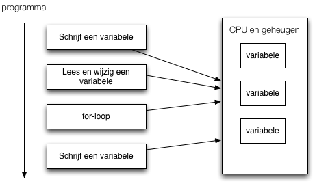
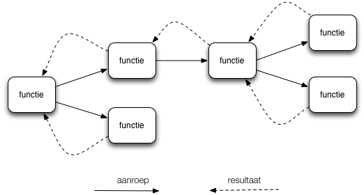
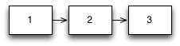

.notes landslide gastcollege.md --linenos=inline -c -r

# Gastcollege Clojure @ HAN
28-05-2013

Michiel Borkent

---
# Wie ben ik?

* Michiel Borkent
   	- 1999 – 2005 Technische Informatica @ Universiteit Twente
   	- 2006 - 2010 Software-ontwikkelaar (diverse programmeertalen)
   	- 2010-2013 Docent Informatica @ Hogeschool Utrecht
   	- 2013 - heden Software-ontwikkelaar bij [Finalist ICT](http://www.finalist.nl)

---

# Waarom vind ik FP interessant?
- hoger abstractieniveau, elegantie, meer 'declaratief'
- meer doen met minder code
- concurrency/parallellisme
- nieuwsgierig: hoe los je iets op in verschillende paradigma’s?

---

# Wat is Clojure?
- Relatief jonge programmeertaal: 2007.
- Ontworpen door Rich Hickey
- Gebaseerd op een van de oudste programmeertalen: Lisp (1958)
- Ontworpen om te draaien op bestaande hostomgevingen: JVM, CLR, Javascript-engines

---
# Wat is Clojure?
- Keep it Simple: 'low profile architecture'
- Clojure is een dynamische getypeerde functionele programmeertaal
- Combineert een boel invloeden van andere programmeertalen

---
# Eigen ervaring met FP/Lisp/Clojure
- Eerste programmeervak van mijn opleiding was in Miranda, voorloper van Haskell
- Afstudeeropdrachten op het gebied van muzikale data en functioneel programmeren (Common Lisp)
- Vanaf 2009: Clojure hobbymatig
- In 2011 HBO-studenten onderzoek laten doen naar verschillen software ontwikkelen in Clojure vs OO
- In 2012 een cursus ‘Functioneel Programmeren in Clojure’ ontwikkeld,
  loopt voor de derde keer (zie: <http://michielborkent.nl/clojurecursus>)
- Vanaf 2013 bij Finalist commercieel project met Clojure en Datomic

---
# Wat is functioneel programmeren?
- Pure functies
- Hogere orde functies
- Immutability/persistente datastructuren
- Lazyness

Korte uitleg van deze begrippen aan de hand van Clojure.

Eerst: hoe kun je de voorbeelden uit deze sheets zelf uitproberen?

---
# REPL
- Interactieve manier van ontwikkelen
- REPL: Read Eval Print Loop

		!clojure
		user=>                         <- prompt
---

# REPL
- Interactieve manier van ontwikkelen
- REPL: Read Eval Print Loop

		!clojure
		user=> (inc 1)                 <- expressie
		2                              <- resultaat

---

# REPL
- Interactieve manier van ontwikkelen
- REPL: Read Eval Print Loop

		!clojure
		user=> (println "hello world") <- expressie
		hello world                    <- side effect
		nil                            <- resultaat
---

# Ontwikkelomgevingen
- Voor Eclipse-gebruikers: CounterClockwise plugin: <https://code.google.com/p/counterclockwise/>
- CCW is verreweg de beste en meest actief ontwikkelde plugin vergeleken met andere IDES+plugins
- Mocht je een extra uitdaging willen: Emacs + nrepl.el
- Recent ook voor Intellij: cursive clojure plugin

---

# CounterClockwise
- Biedt per Clojure-project een REPL in Eclipse
- Biedt Leiningen ondersteuning
- Leiningen is Maven met een Clojure-schil eromheen (+ veel meer)
- Nieuw Clojure project

---

# CounterClockwise
- Inhoud `project.clj`, vergelijkbaar met `pom.xml` van Maven, maar
  dan Clojure-notatie ipv XML
- Clojure is zelf gewoon een dependency.
- Versie is dus per project
  makkelijk in te stellen.

		!clojure
		(defproject gastcollege "0.1.0-SNAPSHOT"
  			:description "FIXME: write description"
  			:url "http://example.com/FIXME"
  			:license {:name "Eclipse Public License"
           	          :url "http://www.eclipse.org/legal/epl-v10.html"}
  			:dependencies [[org.clojure/clojure "1.5.1"]])
---

# REPL starten voor project
Run as Clojure application

---

# Functieaanroep

    !clojure
    (inc 1)

in plaats van:

    !javascript
    inc(1)

Dit noem je ook wel prefix-notatie.

---

# If-expressie

    !clojure
    (if (< (rand-int 10) 5)
      "Getal kleiner dan 5"
      "Getal groter dan of gelijk aan 5")

---

# Let
    !clojure
    (let [x (+ 1 2 3)
          y (+ 4 5 6)
          z (+ x y)]
      z) ;;=> 21

---

# Terug naar wat is FP?
Imperatief programmeren
=
Place oriented programming

---

# Terug naar wat is FP?
Functioneel programmeren
=
Value oriented programming

---
# Pure functies
Conceptueel zoals wiskundige functie:

- gegarandeerd dezelfde output bij dezelfde input
- een functie-aanroep kan dus altijd vervangen worden door zijn uitkomst
- geen (serieuze) side effects (IO, mutatie van objecten, etc)

---
# Pure functies
De meeste functies in Clojure zijn puur.

    !clojure
    (inc 10) ;;=> 11
    (inc 11) ;;=> 12
    (count "foo") ;;=> 3
    (count "dude") ;;=> 4
    (str "foo" "bar") ;;=> "foobar"

---
# Pure functies
Niet-pure functies zijn echter gewoon
mogelijk (i.t.t. Haskell)

    !clojure
    (rand-int 10) ;;=> 7
    (rand-int 10) ;;=> 0
    (time (inc 1)) ;;=>
    "Elapsed time: 0.022 msecs" <- side effect
    2                           <- resultaat
    user=> (time (inc 1))
    "Elapsed time: 0.024 msecs" <- side effect
    2                           <- resultaat

- Waarom zijn `rand-int` en `time` niet puur?
- NB: `time` is een speciaal soort functie, nl. een macro

---

# Pure functies
- Makkelijker testbaar
- Geen afhankelijkheid van globale state (bv attributen van een klasse
  of object)
- Dus makkelijker lokaal uit te proberen (REPL) en over te redeneren
- Veel aanroepen van pure functies zijn makkelijker te parallelliseren, omdat ze onafhankelijk van elkaar kunnen draaien
- Compiler kan optimaliseren (Haskell, C, …)
- Clojure gebruikt puurheid van functies in combinatie met
  concurrency-mechanismen (atoms, refs, ...)

---
# Voorbeeld atom + pure functies

    !clojure
    (def game-state (atom {:score 0}))

    (defn increase-score [old-state points]
    (update-in old-state [:score] + points))

    ;; test:
    (increase-score {:score 40} 20) ;;=> {:score 60}

    (defn score! []
      (swap! game-state increase-score 20))

    @game-state ;;=> {:score 0}
    (score!)
    @game-state ;;=> {:score 20}
    (score!)
    @game-state ;;=> {:score 40}

---
# Voorbeeld parallellisatie
    !clojure
    (defn reverse-str [s]
      (apply str
             (reverse s)))

    (reverse-str "foo") ;;=> "oof"

Sequentieel

    !clojure
    (map reverse-str ["foo" "bar" "baz"])
    ;;=> ("oof" "rab" "zab")

Parallel (1 letter verschil)

    !clojure
    (pmap reverse-str ["foo" "bar" "baz"])
    ;;=> ("oof" "rab" "zab")

---
# Hogere orde functie
1. Functie die een of meer functies als invoer heeft
2. Of: functie die een andere functie oplevert (komen we vandaag niet
   aan toe)

---
# Hogere orde functie: map
    !clojure
    (map inc [1 2 3]) ;;=> (2 3 4)

- Invoer-functie is hier `inc`
- Past invoerfunctie toe op elk element in een collectie.
- Levert een nieuwe collectie op.

---
# Hogere orde functie: filter
    !clojure
    (odd? 1) ;;=> true
    (odd? 2) ;;=> false
    (range 10) ;;=> (0 1 2 3 4 5 6 7 8 9)
    (filter odd? (range 10)) ;;=> (1 3 5 7 9)

- Invoer-functie is hier `odd?`
- filtert de elementen uit een collectie waarvoor functie 'logisch
  waar' oplevert
  (In Clojure is alles behalve `nil` en `false` logisch waar)

---
# Hogere orde functie: reduce
    !clojure
    (reduce + [1 2 3 4 5]) ;;=> 15

Stappen:

    !clojure
    (reduce + [1 2 3 4 5])
    (+ 1 2) ;;=> 3
    (reduce + [3 3 4 5])
    (+ 3 3 ) ;;=> 6
    (reduce + [6 4 5])
    (+ 6 4) ;;=> 10
    (reduce + [10 5])
    (+ 10 5) ;;=> 15
    15

---
# Hogere orde functie: reduce
Veel functies gebruiken intern `reduce`, waardoor ze zijn aan te
roepen met een variabel aantal argumenten:

    !clojure
    (+ 1 2 3 4 5) ;;=> 15

---
# Hogere orde functie: reduce
Complexere functie: `frequencies`:

    !clojure
    (frequencies ["foo" "bar" "bar" "foo" "baz"])
    ;;=> {"foo" 2, "bar" 2, "baz" 1}

- Hoe zou je dit kunnen aanpakken met `reduce`?
- We zullen dit voorbeeld zometeen gaan uitwerken, eerst kennis nodig
  van hashmaps in Clojure

---
# Persistente datastructuren
- een instantie van een datastructuur wijzigt niet meer na constructie
- een nieuwe instantie kan gebaseerd worden op de structuur van een oudere instantie

---
# Lijsten (immutable)

    !clojure
    (def l1 (list 1 2 3))
    (def l2 (conj l1 0))
    l2 ;;=> (0 1 2 3)

Structural sharing:

---
# Vectoren (immutable)

    !clojure
    (def v [1 2 3])
    (rest v) ;;=> (2 3)
    (conj v 4) ;;=> [1 2 3 4]
    (pop v) ;;=> [1 2]
    (assoc v 0 10) ;;=> [10 3 4]
    (subvec v 1 2) ;;=> [2]

Je kunt vectoren niet wijzigen. Wel nieuwe maken op basis van oude.

---
# Hashmaps (immutable)
    !clojure
    (def m {:a "foo", :b "bar"})
    (get m :a) ;;=> "foo"
    (get m :c) ;;=> nil
    (get m :c :not-found) ;;=> :not-found
    (assoc m :c "baz") ;;=> {:a "foo", :c "baz", :b "bar"}

---
# Hashmaps (immutable)
    !clojure
    ({:a "foo" :b "bar"} :a) ;;=> "foo"

    (:b {:a "foo" :b "bar"}) ;;=> "bar"

- maps zijn functies van keywords
- keys zijn functies van maps

---
# Voordelen persistente datastructuren
- Vanwege immutabiliteit voorkom je veel lastige
  concurrency-situaties: niet hoeven nadenken over locking
- Zijn erg efficiënt vanwege structural sharing (geen duplicering van
  overlappende structuur)
- Vrij te delen met andere softwaremodules zonder ernstige dependencies te creeëren: geen DTOs of object-clones nodig zoals in Java

---
# Hogere orde functie: reduce
We weten nu alle ingrediënten om zelf `frequencies` te kunnen
programmeren...

    !clojure
    (frequencies ["foo" "bar" "bar" "foo" "baz"])
    ;;=> {"foo" 2, "bar" 2, "baz" 1}

- Hoe zou je dit kunnen aanpakken met `reduce`?
- Stap 1: maak een functie van 2 argumenten welke 1 stap van de
  iteratie kan berekenen en test de functie
- Stap 2: toepassen met `reduce`

---
# Eerst even imperatief (Python)

    !python
    def frequencies(coll):
      result = {}
      for elt in coll:
        if elt in result:
          result[elt] += 1
        else:
          result[elt] = 1
      return result

    frequencies(["foo","bar","foo", "bar","baz"])
    => {'bar': 2, 'baz': 1, 'foo': 2}

---
# Stap 1
Maak een functie `f` zodat:

    !clojure
    (f {} "foo")                ;;=> {"foo" 1}
    (f {"foo" 1} "foo")         ;;=> {"foo" 2}
    (f {"foo" 1 "bar" 1} "foo") ;;=> {"foo" 2 "bar" 1}
    (f {"foo" 1} "bar")         ;;=> {"foo" 1, "bar" 1}

    (defn f [m e]
      ...)

---
# Testen definiëren in Clojure

    !clojure
    (use 'clojure.test)
    (declare f) ;; f bestaat nog niet
    (deftest test-f
      (is (= (f {} "foo") {"foo" 1}))
      (is (= (f {"foo" 1} "foo") {"foo" 2}))
      (is (= (f {"foo" 1 "bar" 1} "foo") {"foo" 2 "bar" 1}))
      (is (= (f {"foo" 1} "bar") {"foo" 1, "bar" 1})))

    (run-tests)
    Ran 1 tests containing 4 assertions.
    0 failures, 4 errors.
    {:type :summary, :pass 0, :test 1, :error 4, :fail 0}

4 errors, want `f` is nog niet gedefiniëerd

---
# Stap 1
Maak een functie `f` zodat:

    !clojure
    (f {} "foo")                ;;=> {"foo" 1}

    (defn f [m e]
      (if (= m {}) {e 1}))

    (run-tests)

    ...

---
# Stap 1
    !console
    Testing user

    FAIL in (test-f) (NO_SOURCE_FILE:3)
    expected: (= (f {"foo" 1} "foo") {"foo" 2})
      actual: (not (= nil {"foo" 2}))

    FAIL in (test-f) (NO_SOURCE_FILE:4)
    expected: (= (f {"foo" 1, "bar" 1} "foo") {"foo" 2, "bar" 1})
      actual: (not (= nil {"foo" 2, "bar" 1}))

    FAIL in (test-f) (NO_SOURCE_FILE:5)
    expected: (= (f {"foo" 1} "bar") {"foo" 1, "bar" 1})
      actual: (not (= nil {"foo" 1, "bar" 1}))

    Ran 1 tests containing 4 assertions.
    3 failures, 0 errors.
    {:type :summary, :pass 1, :test 1, :error 0, :fail 3}

---
# Stap 1

Maak een functie `f` zodat:

    !clojure

    (is (= (f {"foo" 1} "foo") {"foo" 2}))

    (contains? {:a 1 :b 2} :a) ;;=> true
    (contains? {:a 1 :b 2} :c) ;;=> false

    (defn f [m e]
      (if (= m {}) {e 1}
        (if (contains? m e)
          (assoc m e (inc (m e))))))

    (run-tests)
    ...

---
# Stap 1
    !console
    Testing user

    FAIL in (test-f) (NO_SOURCE_FILE:5)
    expected: (= (f {"foo" 1} "bar") {"foo" 1, "bar" 1})
      actual: (not (= nil {"foo" 1, "bar" 1}))

    Ran 1 tests containing 4 assertions.
    1 failures, 0 errors.
    {:type :summary, :pass 3, :test 1, :error 0, :fail 1}

NB, de case

    !clojure
    (is (= (f {"foo" 1 "bar" 1} "foo") {"foo" 2 "bar" 1}))

slaagt ook al.

---
# Stap 1
    !clojure
    (defn f [m e]
      (if (= m {}) {e 1}
        (if (contains? m e)
          (assoc m e (inc (m e)))
          (assoc m e 1))))

    (run-tests)

    Testing user

    Ran 1 tests containing 4 assertions.
    0 failures, 0 errors.
    {:type :summary, :pass 4, :test 1, :error 0, :fail 0}

Het werkt! Nog niet helemaal 'idiomatic'. Zometeen refactoren. Nu
eerst even stap 2.

---
# Stap 2
    !clojure
    user=> (reduce f ["foo" "bar" "bar" "foo" "baz"])
    IllegalArgumentException contains? not supported on type:
    java.lang.String  clojure.lang.RT.contains (RT.java:724)

Dit klopt. Functie `f` verwacht een map en een element (string).

---
# Stap 2

    !clojure
    (reduce f {} ["foo" "bar" "bar" "foo" "baz"])
    ;;=> {"baz" 1, "bar" 2, "foo" 2}

Zelfde als:

    !clojure
    (reduce f [{} "foo" "bar" "bar" "foo" "baz"])

Stappen:

    !clojure
    (f {} "foo") ;;=> {"foo" 1}
    (f {"foo" 1} "bar") ;;=> {"foo" 1 "bar" 1}
    (f {"foo" 1 "bar" 1} "bar") ;;=> {"foo" 1 "bar" 2}
    (f {"foo" 1 "bar" 2} "foo") ;;=> {"foo" 2 "bar" 2}
    (f {"foo" 2 "bar" 2} "baz") ;;=> {"baz" 1, "bar" 2, "foo" 2}

---
# Stap 2
De functie `frequencies`:

    !clojure
    (defn f [m e]
      (if (= m {}) {e 1}
        (if (contains? m e)
          (assoc m e (inc (m e)))
          (assoc m e 1))))

    (defn frequencies [coll]
      (reduce f {} coll))

---
# Stap 2
De functie `frequencies`:

    !clojure
    (defn- f [m e] ;; private function
      (if (= m {}) {e 1}
        (if (contains? m e)
          (assoc m e (inc (m e)))
          (assoc m e 1))))

    (defn frequencies [coll]
      (reduce f {} coll))

---
# Stap 2
De functie `frequencies`:

    !clojure
    (defn frequencies [coll]
      (let [reducefn (fn [m e] ;; local function
                       (if (= m {}) {e 1}
                         (if (contains? m e)
                           (assoc m e (inc (m e)))
                           (assoc m e 1))))]
      (reduce reducefn {} coll)))

---
# Stap 2
De functie `frequencies`:

    !clojure
    (defn frequencies [coll]
      (reduce (fn [m e] ;; anonymous function
                (if (= m {}) {e 1}
                  (if (contains? m e)
                    (assoc m e (inc (m e)))
                    (assoc m e 1))))
              {} coll))

De reduce-functie kan mooier/korter.
Overbodige case, wie ziet 'em?

---
# assoc
Indien lege map meegegeven:

    !clojure
    (= m {}) {e 1}

Indien niet lege map en key zat nog niet in de map:

    !clojure
    (assoc {"foo" 1} "bar" 1) ;;=> {"foo" 1 "bar" 1}

Maar:

    !clojure
    (assoc {} "foo" 1) ;;=> {"foo" 1}

Dus 'special case' is onnodig.

---
# Stap 2
    !clojure
    (defn frequencies [coll]
      (reduce (fn [m e]
                (if (contains? m e)
                  (assoc m e (inc (m e)))
                  (assoc m e 1)))
              {} coll))

De reduce-functie kan nóg mooier/korter.
Wie heeft een suggestie?

---
# Map lookup met default waarde
    !clojure
    (def m {"foo" 1 "bar" 2})
    (m "foo") ;;=> 1
    (m "bar") ;;=> 2
    (m "baz") ;;=> nil
    (m "baz" :not-found) ;;=> :not-found
    (m "baz" 0) ;;=> 0

---
# Stap 2
    !clojure
    (defn frequencies [coll]
      (reduce (fn [m e]
                  (assoc m e (inc (m e 0))))
              {} coll))

---
# Functioneel vs imperatief
    !clojure
    (defn frequencies [coll]
      (reduce (fn [m e]
                  (assoc m e (inc (m e 0))))
              {} coll))

vs

    !python
    def frequencies(coll):
      result = {}
      for elt in coll:
        if elt in result:
          result[elt] += 1
        else:
          result[elt] = 1
      return result

---
# frequencies in clojure.core:

    !clojure
    (defn frequencies
      "Returns a map from distinct items in coll to the number of times
      they appear."
      {:added "1.2"
       :static true}
      [coll]
      (persistent!
       (reduce (fn [counts x]
                 (assoc! counts x (inc (get counts x 0))))
               (transient {}) coll)))

Transients optimalisatie, algoritme is hetzelfde.

---
# Webapplicatie woorden tellen
In Eclipse:

- New Clojure project genaamd `freqweb`
- Template: compojure-app (zie
  <https://github.com/yogthos/compojure-template>)
- Open source file `freqweb.repl.clj`
- In Clojure-menu: Load file in REPL (Ctrl-Alt-L of Cmd-Alt-L)
- In REPL: `(start-server)`
- Browser opent zich met 'Hello World'

---
# Textarea toevoegen
In `freqweb.routes.home.clj`

    !clojure
    (ns freqweb.routes.home
      (:require [compojure.core :refer :all]
                [freqweb.views.layout :as layout])
      (:use [hiccup.form])) ;; <-

---
# Textarea toevoegen
In `freqweb.routes.home.clj`

    !clojure
    (defn home []
      (layout/common
        [:div
         [:p "Please enter some text for analysis"]
         (form-to [:post "/myresult"]
                  (text-area {:rows "4" :cols "50"} "mytext")
                  [:br]
                  (submit-button "Send"))]))

---
# De eerste pagina

---
# Afhandeling POST

    !clojure
    (defn myresult [text]
      (let [words (clojure.string/split text #" ")
            freqs (frequencies words)]
       (layout/common [:p (str freqs)])))

    (defroutes home-routes
      (GET "/" [] (home))
      (POST "/myresult" [mytext] (myresult mytext)))

---
# Tekst invullen

---
# Resultaat (ruwe data)

---
# Verbetering?
Hoe tonen we bijvoorbeeld de top 5 resultaten in een mooie tabel?

---
# Sorteren van collecties
Bijvoorbeeld sorteren op lengte van strings

    !clojure
    (sort (fn [a b] (< (count a) (count b)))
          ["dog" "elephant" "bird"])
    ;;=> ("dog" "bird" "elephant")
    (sort-by count < ["dog" "elephant" "bird"])
    ;;=> ("dog" "bird" "elephant")

(Vraag: is `sort` een hogere orde functie?)

---
# Map als collectie sorteren

    !clojure
    (def m {"foo" 1 "bar" 2 "baz" 4 "qux" 3})
    (seq m) ;;=> (["foo" 1] ["bar" 2] ["qux" 3] ["baz" 4])
    (sort (fn [a b] (> (second a) (second b))) m)
    ;;=> (["baz" 4] ["qux" 3] ["bar" 2] ["foo" 1])
    (sort-by second > m)
    ;;=> (["baz" 4] ["qux" 3] ["bar" 2] ["foo" 1])
    (take 2 (sort-by second > m)) ;;=> (["baz" 4] ["qux" 3])

---
# Top 5 van frequentietabel
    !clojure
    (defn select-top-5 [freqs]
      (take 5 (sort-by second > freqs)))

---
# Nieuwe resultaatpagina
    !clojure
    (defn myresult [text]
      (let [words (clojure.string/split text #" ")
            freqs (frequencies words)
            top5 (select-top-5 freqs)]
       (layout/common [:p (for [[word amount] top5]
                            [:p "The word " word
                                " occurs " amount " times"])]
                      [:a {:href "/"} "Back"])))

---
# Nieuwe resultaatpagina

---
# Meer leren

<http://www.4clojure.com>

x
---
# Meer leren
<http://www.clojurebook.com>

---
# Meer leren

<http://michielborkent.nl/clojurecursus>

---
# Einde

Bedankt voor jullie aandacht!

Vragen?

- Twitter: [@borkdude](http://www.twitter.com/borkdude)
- Homepagina: <http://michielborkent.nl>

